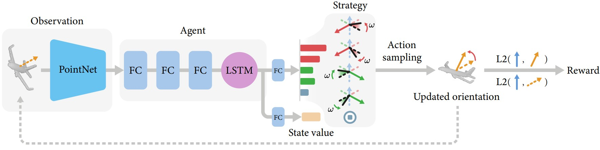

# UprightRL: Upright orientation estimation of 3D shapes via reinforcement learning



## Introduction

In this paper, we study the problem of 3D shape upright orientation estimation from the perspective of reinforcement learning,
i.e. we teach a machine (agent) to orientate 3D shapes step by step to upright given its current observation. Unlike previous
methods, we take this problem as a sequential decision-making process instead of a strong supervised learning problem. To
achieve this, we propose UprightRL, a deep network architecture designed for upright orientation estimation.

<!-- For more details and materials, please refer to our [project page](xxx). -->


## Dependencies
Check `requirements.txt` for more details.


## Usage

All codes are tested on Ubuntu 18.04 and Windows 10.
### Training
```
./scripts/train.sh
```
### Testing
```
./scripts/test.sh
```
### Render ( check render folder for detial )
```
cd render/
blender -b render_demo.blend -P render_single_pcd.py
```

## Network structure:

Layer | Input dim | Output dim
:-: | :-: | :-:
PointNet Encoder | (3, 2048) | 1024 |
FC | 1024 | 512 |
Batch Normalize | - | - |
FC | 512 | 256 |
Batch Normalize | - | - |
FC | 256 | 128 |
Batch Normalize | - | - |
LSTM | 128 | 128 |
Actor FC | 128 | 5 |
Critic FC | 128 | 1 |

## File structure:

* **code/**: Main code folder.
* **render/**: Render code.
* **dataset/**: Dataset folder, *[release soon]*.
* **pretrain/**: Model we trained before.
* **scripts/**: Some scripts to train/test network.

### Parameters of main.py
    ========= Task setting =========
    --task: string, the task to do
        "test": test the network without training
        "train": train the network

    --n_epochs: int, epoch num
    --batch_size: int, batch size, default as 128

    --num_steps: int, number of forward steps in uprightRL model
    --rot_angle: int, angle step to use for each action update
    --num_point: int, point cloud num of input

    ========= Data setting =========
    --data_type: string, the dataset type
        'complete': complete dataset
        'partial': partial dataset
        'single_scan': single scan dataset
        'uprl': dataset from [LZL16]

    --data_dir: string, the path of dataset

    ========= Result folder setting =========

    --result_dir: string, the folder will save the results

    --note: string, any words you want to say
        When the main.py is running, it will create a folder under to store the result, and the note string will be a part of the folder's name

    --pretrain_dir: string, the location of pre-trained network model
        If the path for a model of network is "./model/best.pth", then the checkpoint should be "./model/"
    

Example:

    python ./code/main.py \
        --cuda='0' \
        --task='train' \
        --num_step=20 \
        --n_epochs=400 \
        --batch_size=4 \
        --rot_angle=4 \
        --data_type='single_scan' \
        --data_dir='./dataset' \
        --result_dir='./outputs' \
        --note='example'

This command means you want to train the network in **400** epochs, batch size is **4**, using the **single_scan** dataset in **./dataset** folder. The max steps num is **20** steps, each rotation angle step is **4** degree.

Then it will generate a folder unber **./outputs** folder to store the training or testing result.
The folder structure of `./outputs` may looks like this:

    outputs/
    └── train/   <--- your task
        └── xxxx/  <--- the folder create by our code
            ├── checkpoints/     <--- store models of each epoch
            ├── logs/            <--- some log info
            ├── plots/           <--- some reward / loss curve
            └── xxx.h5           <--- the test/val result

The `dataset/` folder contain the data, the folder structure of `dataset` looks like this:

    dataset/
    ├── shapenet_new/
    ├── shapenet_partial_new/
    ├── shapenet_single_scan/
    └── upright16_data/
        └── testTTA/

Under these folders, we have many kinds for dataset, `shapenet_new` is the complete dataset, `shapenet_partial_new` is the partial dataset, `shapenet_single_new` is the single scan dataset, `upright16_data` is the dataset from [LZL16](https://github.com/zishun/UprightOrientation).

<!-- ## Citation
Please cite the paper in your publications if it helps your research:
```
coming soon
``` -->

## License
Our code is released under MIT License. See LICENSE file for details.
